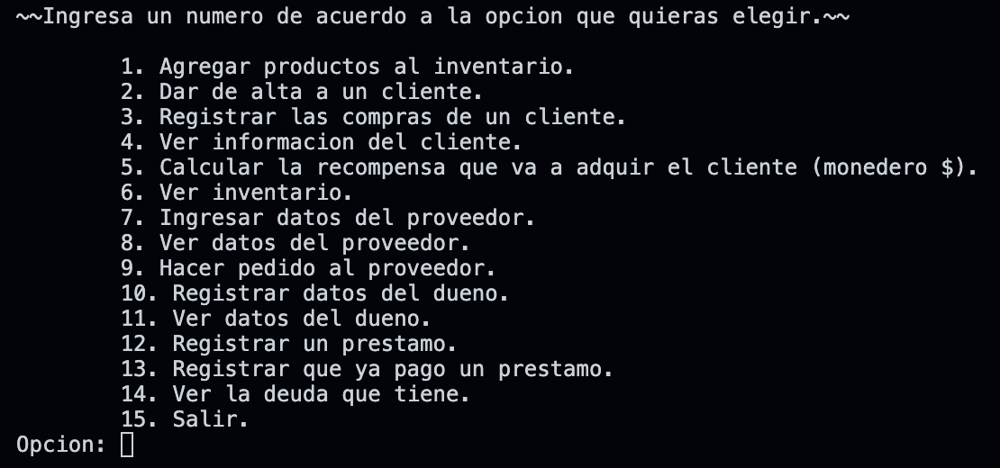
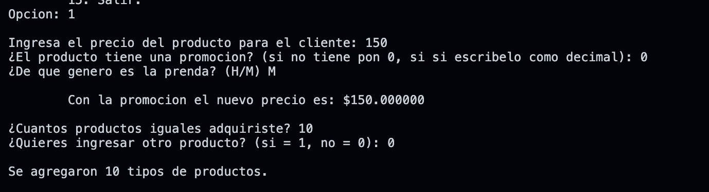
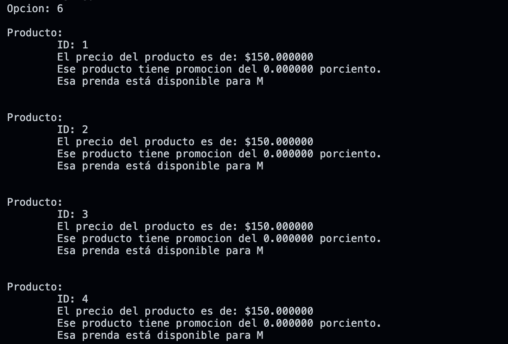

#   POO Integrating Project

## Description
This was the final project for the subject "Object Oriented Computational Thinking" where I was asked to make a simulation of a software for a clothes store using Object Oriented Programming by definning the UML for the classes that I implemented for the main application. 

## Main Learnings 
* Classes Definition
* Classes Relationships
* UML Diagrams
* Object Oriented Analysis and Definition 
* C++ Syntax
* C++ Header Files 

## Installation
* Make sure to have installed a C++ enviroment 
* Download the repository on your local machine
* Run the command <code>./aplication</code> on the terminal located at the root path of the project or just open the <code>aplication.exe</code> file

## Screenshots

  
